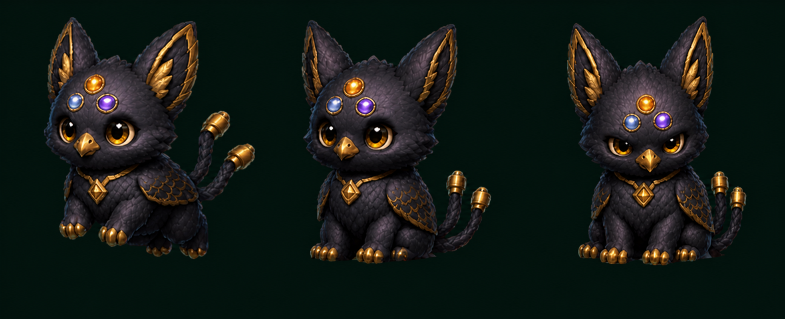
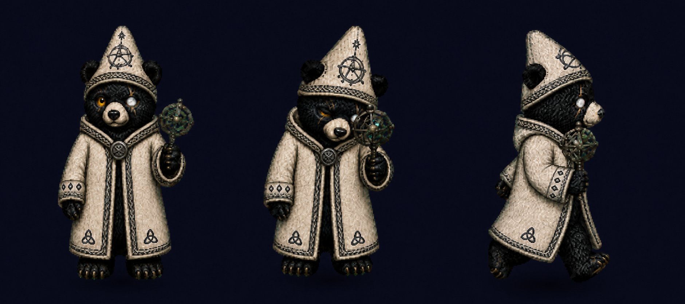

# Coding Pets

A public catalogue of my custom animated pets made via iteration with the "hatch-pet" skill in Codex, with enough portable context for Hermes Agent and other local agents.

## Meet the pets

### Triskel

[](pets/triskel/showcase/three-pose.png)

A plush three-node fox-ibis messenger familiar for Hermes Agent, with wing-shaped ears, opal brow nodes, gold circuitry, and twin cable tails. Triskel greets naturally and turns active processing into an attentive ear-scan.

[Character and motion guide](pets/triskel/hermes.md) · [Codex manifest](pets/triskel/pet.json) · [QA evidence](pets/triskel/qa/)

### Little Magus

[](pets/odin-bear-little-magus/showcase/three-pose.png)

A soot-black Hermetic bear familiar in a pale embroidered coat and conical cap. Little Magus verifies work with a single connected blackened-silver armillary, balancing quiet storybook warmth with careful ritual focus.

[Character and motion guide](pets/odin-bear-little-magus/hermes.md) · [Codex manifest](pets/odin-bear-little-magus/pet.json) · [QA evidence](pets/odin-bear-little-magus/qa/)

### Vesper

[](pets/vesper/preview.png)

An opalescent violet-feathered threshold spirit with three luminous glass antennae.

[Character and motion guide](pets/vesper/hermes.md) · [Codex manifest](pets/vesper/pet.json) · [QA evidence](pets/vesper/qa/)

---

The canonical index is [`catalog.json`](catalog.json). Each pet lives under `pets/<pet-id>/` and carries its own manifest, packaged sprite atlas, preview, provenance, retained QA evidence, and a [`concept-development/`](pets/vesper/concept-development/) record of the visual exploration behind it.

## Add a pet

1. Copy `templates/pet/` to `pets/<pet-id>/`.
2. Replace the placeholders and add the validated `spritesheet.webp` and a clear `preview.png`.
3. Add selected visual iterations to `concept-development/` and record their role and outcome in its `README.md`. Keep rejected concepts clearly labeled; concepts are not shipped pet assets.
4. Add a visible pet card near the top of this README so visitors can judge the pet immediately.
5. Add the machine-readable entry to `catalog.json`.
6. Run `python3 scripts/validate_catalog.py`.

New Codex pets use the v2 atlas contract: `1536×2288`, `192×208` cells, 8 columns, 11 rows, and `spriteVersionNumber: 2`. The first nine rows contain app states; the final two contain 16 clockwise look directions.

## Install in Codex

Copy a pet directory containing `pet.json` and `spritesheet.webp` into:

```text
~/.codex/pets/<pet-id>/
```

## Use from Hermes

Hermes should read `catalog.json`, then the selected pet's `pet.json` and `hermes.md`. Agent-facing workflow guidance is in [`AGENTS.md`](AGENTS.md) and [`HERMES.md`](HERMES.md).

## Publishing policy

- Publish final packages, compact previews, provenance, and meaningful QA evidence.
- Preserve useful concept development with honest labels such as `exploration`, `candidate`, `approved-reference`, or `rejected`.
- Keep prompts, decoded row strips, extracted frames, and temporary generation assets out of Git.
- Never claim a pet is validated unless its retained validation files pass.
- Preserve human authorship notes and creative intent; agents should not silently rank or replace variants.

## Licensing

The published pets themselves are licensed under [Creative Commons Attribution 4.0 International](LICENSE.md). This covers each pet's spritesheet, previews, character guide, and pet-specific metadata. It does **not** claim ownership of or license the Hatch Pet method, Codex, Hermes Agent, supporting software, or third-party tools.

The license grants only the rights, if any, that the catalogue owner is authorized to grant. It does not claim that AI-assisted material is automatically copyrightable, and it does not remove anything from the public domain or create rights where none exist.

Suggested attribution:

```text
Vesper by mlflautt — CC BY 4.0 — https://github.com/mlflautt/coding-pets
```
