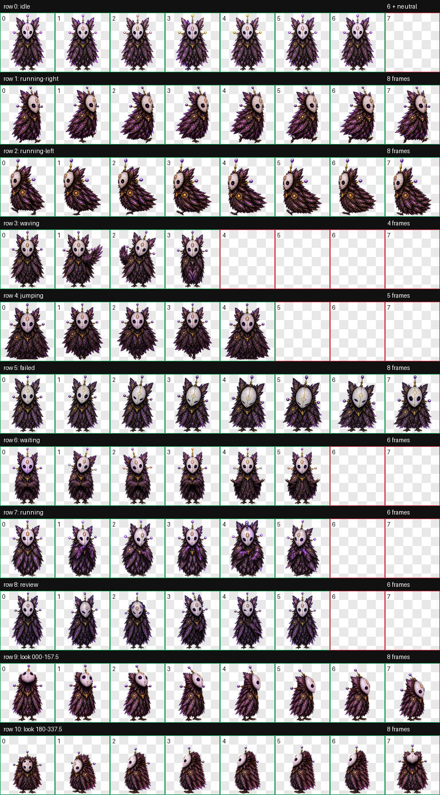

# Coding Pets

A public catalogue of custom animated pets for Codex, with enough portable context for Hermes Agent and other local agents to understand their identity and motion. This repository shares the **pets themselves**—it is not a publication of or claim over the Hatch Pet creation method.

## Meet the pets

### Vesper

[](pets/vesper/preview.png)

An opalescent violet-feathered threshold spirit whose three luminous glass antennae signal agent activity.

[Character and motion guide](pets/vesper/hermes.md) · [Codex manifest](pets/vesper/pet.json) · [QA evidence](pets/vesper/qa/) · **CC BY 4.0**

---

The canonical index is [`catalog.json`](catalog.json). Each pet lives under `pets/<pet-id>/` and carries its own manifest, packaged sprite atlas, preview, provenance, and retained QA evidence.

## Add a pet

1. Copy `templates/pet/` to `pets/<pet-id>/`.
2. Replace the placeholders and add the validated `spritesheet.webp` and a clear `preview.png`.
3. Add a visible pet card near the top of this README so visitors can judge the pet immediately.
4. Add the machine-readable entry to `catalog.json`.
5. Run `python3 scripts/validate_catalog.py`.

New Codex pets use the v2 atlas contract: `1536×2288`, `192×208` cells, 8 columns, 11 rows, and `spriteVersionNumber: 2`. The first nine rows contain app states; the final two contain 16 clockwise look directions.

## Install in Codex

Copy a pet directory containing `pet.json` and `spritesheet.webp` into:

```text
~/.codex/pets/<pet-id>/
```

## Use from Hermes

Hermes should read `catalog.json`, then the selected pet's `pet.json` and `hermes.md`. Agent-facing workflow guidance is in [`AGENTS.md`](AGENTS.md) and [`HERMES.md`](HERMES.md).

## Publishing policy

- Publish final packages, compact previews, provenance, and meaningful QA evidence.
- Keep prompts, decoded row strips, extracted frames, and temporary generation assets out of Git.
- Never claim a pet is validated unless its retained validation files pass.
- Preserve human authorship notes and creative intent; agents should not silently rank or replace variants.

## Licensing

The published pets themselves are licensed under [Creative Commons Attribution 4.0 International](LICENSE.md). This covers each pet's spritesheet, previews, character guide, and pet-specific metadata. It does **not** claim ownership of or license the Hatch Pet method, Codex, Hermes Agent, supporting software, or third-party tools.

The license grants only the rights, if any, that the catalogue owner is authorized to grant. It does not claim that AI-assisted material is automatically copyrightable, and it does not remove anything from the public domain or create rights where none exist.

Suggested attribution:

```text
Vesper by mlflautt — CC BY 4.0 — https://github.com/mlflautt/coding-pets
```
