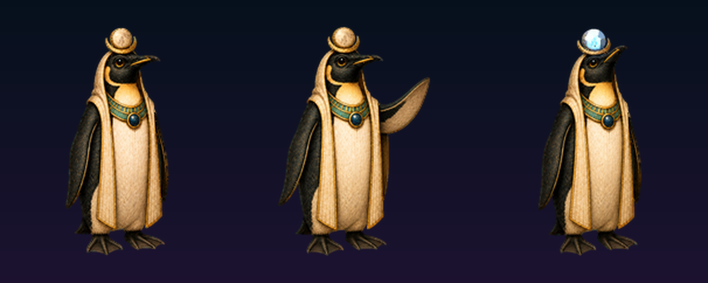
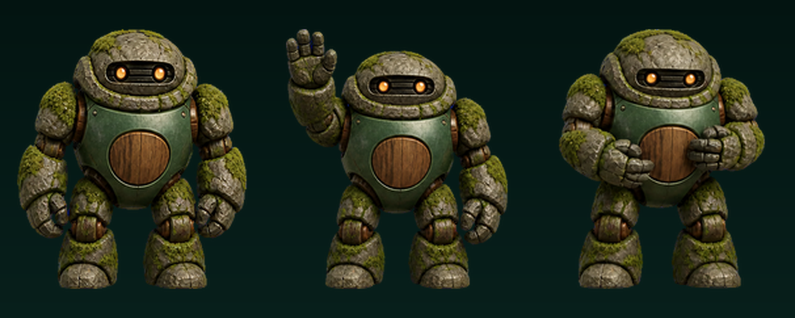
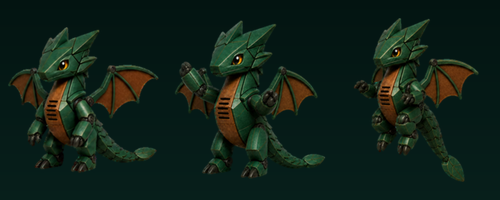
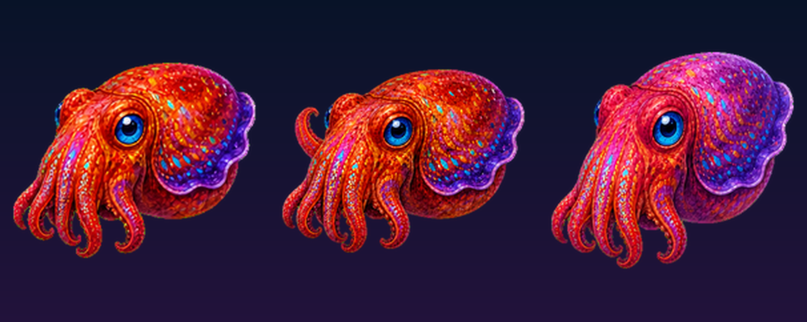
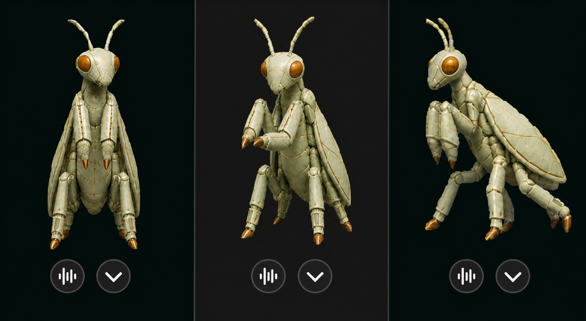
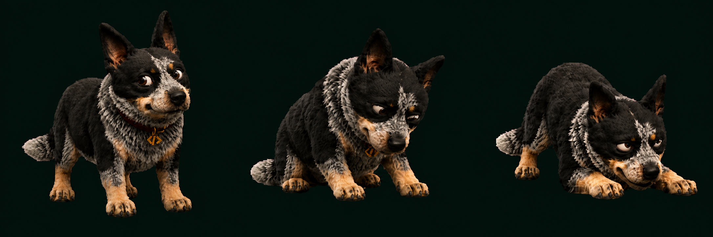

# Coding Pets

A public catalogue of my custom animated pets made via iteration with the "hatch-pet" skill in Codex, with enough portable context for Hermes Agent and other local agents.

## Meet the pets

<!-- BEGIN AUTO-PUBLISHED PETS -->

### Moon Regent

[](pets/moon-regent/preview.png)

A lunar Emperor penguin familiar for Codex and Hermes Agent, expressing measured execution, spiritual insight, and final verification.

[Character and motion guide](pets/moon-regent/hermes.md) · [Codex manifest](pets/moon-regent/pet.json) · [QA evidence](pets/moon-regent/qa/)

### Terra Golem

[](pets/terra-golem/preview.png)

A sturdy moss-covered stone golem with a rounded forest-green metal torso, warm wooden joints and belly panel, and twin amber visor eyes.

[Character and motion guide](pets/terra-golem/hermes.md) · [Codex manifest](pets/terra-golem/pet.json) · [QA evidence](pets/terra-golem/qa/)

### Fern

[](pets/fern/preview.png)

A compact jade-and-walnut forest dragon with angular armor, expressive amber eyes, and refined classic wings.

[Character and motion guide](pets/fern/hermes.md) · [Codex manifest](pets/fern/pet.json) · [QA evidence](pets/fern/qa/)

### Chromia

[](pets/chromia/preview.png)

A vivid recursive cuttlefish familiar inhabiting the Fractal Terra computational reef.

[Character and motion guide](pets/chromia/hermes.md) · [Codex manifest](pets/chromia/pet.json) · [QA evidence](pets/chromia/qa/)

<!-- END AUTO-PUBLISHED PETS -->

### Calamus

[](pets/calamus/showcase/three-pose.png)

A faience mantis scribe familiar inspired by the measured wisdom and written memory of Thoth.

[Character and motion guide](pets/calamus/hermes.md) · [Codex manifest](pets/calamus/pet.json) · [QA evidence](pets/calamus/qa/)

### Cinder

[](pets/cinder/showcase/three-pose.png)

A compact blue-heeler familiar with a faithful face, restrained mysticism, a tiny copper code tag, and a defining wry side-eye.

[Character and motion guide](pets/cinder/hermes.md) · [Codex manifest](pets/cinder/pet.json) · [QA evidence](pets/cinder/qa/)

### Triskel

[](pets/triskel/showcase/three-pose.png)

A plush cat-bird hybrid messenger familiar for Codex, with wing-embroidered ears and twin cable tails, and three-gemstone forehead.

[Character and motion guide](pets/triskel/hermes.md) · [Codex manifest](pets/triskel/pet.json) · [QA evidence](pets/triskel/qa/)

### Little Magus

[](pets/odin-bear-little-magus/showcase/three-pose.png)

A soot-black bear representing Odin, Little Magus gave up one of his eyes to drink from Mímir's well and gain cosmic insight. Choosing the path of the Hermetic Magus, he donned the robes, hat, and armillary of Hermes Trismegistus.  He has finally found his home as a pet in Hermes Agent.

[Character and motion guide](pets/odin-bear-little-magus/hermes.md) · [Codex manifest](pets/odin-bear-little-magus/pet.json) · [QA evidence](pets/odin-bear-little-magus/qa/)

### Vesper

[](pets/vesper/preview.png)

An opalescent violet-feathered threshold spirit with three luminous glass antennae.

[Character and motion guide](pets/vesper/hermes.md) · [Codex manifest](pets/vesper/pet.json) · [QA evidence](pets/vesper/qa/)

---

The canonical index is [`catalog.json`](catalog.json). Each pet lives under `pets/<pet-id>/` and carries its own manifest, packaged sprite atlas, preview, provenance, retained QA evidence, and a [`concept-development/`](pets/vesper/concept-development/) record of the visual exploration behind it.

## Add a pet

1. Copy `templates/pet/` to `pets/<pet-id>/`.
2. Replace the placeholders and add the validated `spritesheet.webp`.
3. Select three characteristic shipped frames in `preview.json`, then run `python3 scripts/update_finalized_pets.py`. See [`docs/AUTOMATIC_PET_UPDATES.md`](docs/AUTOMATIC_PET_UPDATES.md).
4. Add selected visual iterations to `concept-development/` and record their role and outcome in its `README.md`. Keep rejected concepts clearly labeled; concepts are not shipped pet assets.
5. Let the updater regenerate the public preview, provenance hashes, README card, and machine-readable catalogue entry.
6. Run `python3 scripts/update_finalized_pets.py --check` and `python3 scripts/validate_catalog.py`.

New Codex pets use the v2 atlas contract: `1536×2288`, `192×208` cells, 8 columns, 11 rows, and `spriteVersionNumber: 2`. The first nine rows contain app states; the final two contain 16 clockwise look directions.

## Install in Codex

Copy a pet directory containing `pet.json` and `spritesheet.webp` into:

```text
~/.codex/pets/<pet-id>/
```

## Use from Hermes

Hermes should read `catalog.json`, then the selected pet's `pet.json` and `hermes.md`. Agent-facing workflow guidance is in [`AGENTS.md`](AGENTS.md) and [`HERMES.md`](HERMES.md).

## Publishing policy

- Publish final packages, compact previews, provenance, and meaningful QA evidence.
- Preserve useful concept development with honest labels such as `exploration`, `candidate`, `approved-reference`, or `rejected`.
- Keep prompts, decoded row strips, extracted frames, and temporary generation assets out of Git.
- Never claim a pet is validated unless its retained validation files pass.
- Preserve human authorship notes and creative intent; agents should not silently rank or replace variants.

## Licensing

The published pets themselves are licensed under [Creative Commons Attribution 4.0 International](LICENSE.md). This covers each pet's spritesheet, previews, character guide, and pet-specific metadata. It does **not** claim ownership of or license the Hatch Pet method, Codex, Hermes Agent, supporting software, or third-party tools.

The license grants only the rights, if any, that the catalogue owner is authorized to grant. It does not claim that AI-assisted material is automatically copyrightable, and it does not remove anything from the public domain or create rights where none exist.

Suggested attribution:

```text
Vesper by mlflautt — CC BY 4.0 — https://github.com/mlflautt/coding-pets
```
